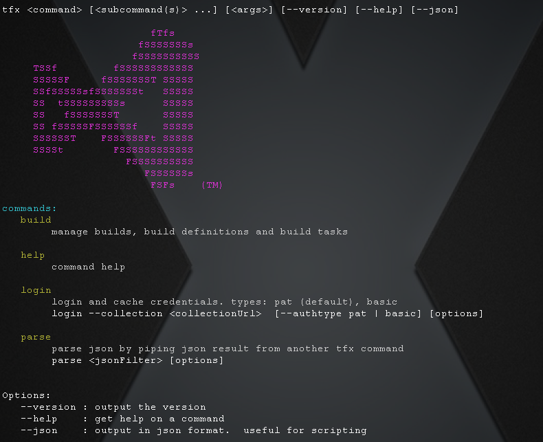

# TFS Extensions Command Line Utility

[](http://badge.fury.io/js/tfx-cli)

This is a utility to manage extensions for TFS.  It is cross platform and supported on Windows, OSX and Linux.

*Pre-release but supported*

## Install
```bash
sudo npm install -g tfx-cli
```
<sub>Note: windows does not need sudo</sub>

## Help
Just type tfx.  It will list the commands and sub commands available
```bash
~$ tfx
```


## Login
To avoid providing credentials in every command, you can login once.
Currently supported credential types are Personal Access Tokens and basic auth.
[Create a personal access token](http://roadtoalm.com/2015/07/22/using-personal-access-tokens-to-access-visual-studio-online) and paste it in the login command
```bash
~$ tfx login
Copyright Microsoft Corporation

Enter collection url > https://youraccount.visualstudio.com
Enter personal access token > 
logged in successfully
```

You can alternatively use basic auth by passing `--authType basic` (read [Configuring Basic Auth](configureBasicAuth.md)).  NTLM will come soon.

## Command Documentation
[Build Tasks](docs/buildtasks.md): create, list, upload and delete your build tasks

[App Extensions](docs/appext.md): manage your app extensions

## Troubleshooting
To see detailed tracing output, you can set a value for the TFX_TRACE environment value and then run commands.  That may offer a clue into the problem.  It will certainly help if logging an issue.

<sub>Linux/OSX</sub>
```bash
export TFX_TRACE=1
```

<sub>Windows</sub>
```bash
set TFX_TRACE=1
```

<sub>PowerShell</sub>
```bash
$env:TFX_TRACE=1
```

setting `TFX_TRACE_CREDS=1` or `TFX_TRACE_CACHE=1` will trace out cred storage.  Typically those should not be set (to avoid leaking creds when sending traces).  Only set if you are troubleshooting credentials.

## Contributing

We take contributions and fixes.  [Read here](docs/contributions.md) for the details.
